# Kanban Board API Architecture

## Overview

This is a FastAPI-based Kanban board REST API with a layered architecture supporting boards, columns, and tasks.

## Component Diagram



## Architecture Layers

### 1. External Clients (HTTP)
- External consumers make HTTP requests to the FastAPI application

### 2. FastAPI Application Layer (`main.py`)
- **Responsibilities**: REST endpoint definitions, request/response validation, exception handling
- **Key Components**:
  - REST Endpoints: `GET`, `POST`, `PUT`, `DELETE` operations
  - Pydantic Models: `BoardCreate`, `BoardUpdate`, `ColumnCreate`, `ColumnUpdate`, `TaskCreate`, `TaskUpdate`
  - HTTP Exception Handling with custom `NotFoundError` handler
  - API routes: `/api/boards`, `/api/columns`, `/api/tasks`

### 3. KanbanService Layer (`service.py`)
- **Responsibilities**: Business logic, entity validation, error handling
- **Key Components**:
  - `KanbanService`: Core business operations for all entities
  - `NotFoundError`: Custom exception for missing entities

### 4. Storage Layer (`storage.py`)
- **Responsibilities**: Data persistence and retrieval
- **Key Components**:
  - `StorageInterface`: Abstract base class defining the storage contract
  - `JsonStorage`: Concrete implementation using JSON file storage

### 5. Data Models (`models.py`)
- **Key Components**:
  - `Board`: Dataclass representing a Kanban board
  - `Column`: Dataclass representing a column within a board
  - `Task`: Dataclass representing a task within a column
  - `KanbanData`: Container holding all boards, columns, and tasks

### 6. Config Module (`config.py`)
- **Responsibilities**: Configuration management for data file paths
- **Key Functions**:
  - `get_data_dir()`: Returns data directory (default: `data/`)
  - `get_data_file()`: Returns full path to `kanban.json`

### 7. Frontend Module (`frontend.py`)
- **Responsibilities**: Frontend interface abstraction
- **Key Components**:
  - `FrontendInterface`: Abstract base class for frontend integration
  - `AngularMock`: Mock implementation for testing

## Data Flow

```
Client Request → FastAPI (main.py) → KanbanService → Storage → JSON File
                           ↑               ↓
                     Pydantic       NotFoundError
                     Models         Exceptions
```

## API Endpoints

### Boards
- `GET /api/boards` - List all boards
- `GET /api/boards/{board_id}` - Get specific board
- `POST /api/boards` - Create new board
- `PUT /api/boards/{board_id}` - Update board
- `DELETE /api/boards/{board_id}` - Delete board

### Columns
- `GET /api/boards/{board_id}/columns` - Get columns for a board
- `POST /api/columns` - Create new column
- `PUT /api/columns/{column_id}` - Update column
- `DELETE /api/columns/{column_id}` - Delete column

### Tasks
- `GET /api/columns/{column_id}/tasks` - Get tasks for a column
- `GET /api/tasks/{task_id}` - Get specific task
- `POST /api/tasks` - Create new task
- `PUT /api/tasks/{task_id}` - Update task
- `DELETE /api/tasks/{task_id}` - Delete task

## Technologies

- **Framework**: FastAPI
- **Validation**: Pydantic
- **Server**: Uvicorn
- **Testing**: pytest, httpx
- **Data Storage**: JSON file (`data/kanban.json`)