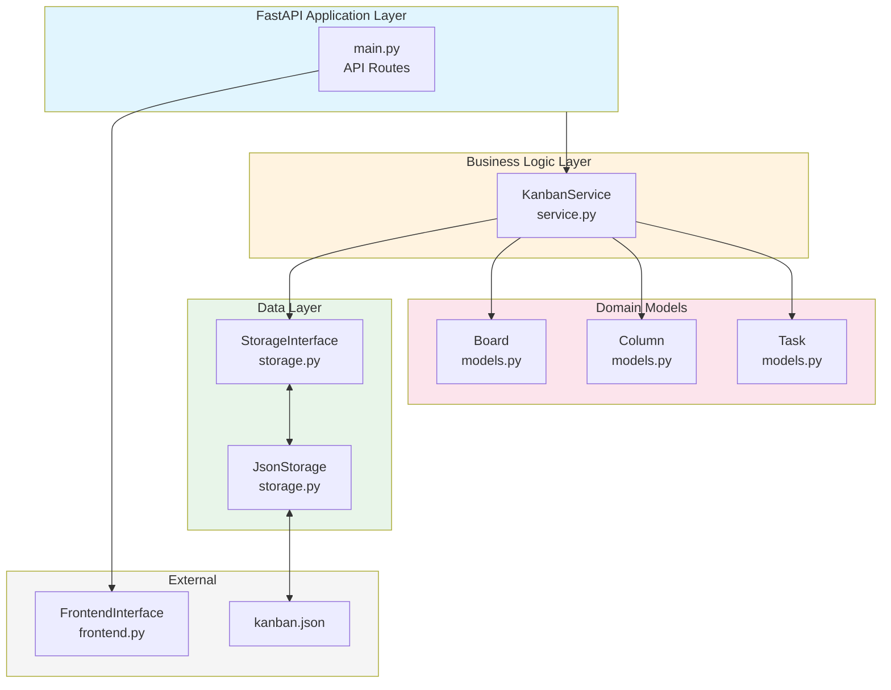

# Architecture Diagram

## Component Overview

- **main.py**: FastAPI routes handling HTTP requests/responses
- **service.py**: Business logic layer (KanbanService)
- **storage.py**: Data persistence (StorageInterface + JsonStorage)
- **models.py**: Domain models (Board, Column, Task)
- **frontend.py**: Frontend interface abstraction
- **config.py**: Configuration (data file paths)