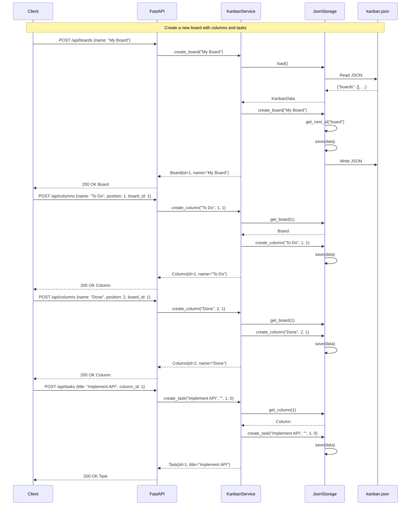

# Sequence Diagram: Create Board with Columns and Tasks

```mermaid
sequenceDiagram
    participant Client
    participant API as FastAPI
    participant Service as KanbanService
    participant Storage as JsonStorage
    participant DataFile as kanban.json

    Note over Client,DataFile: Create a new board with columns and tasks

    Client->>API: POST /api/boards {name: "My Board"}
    API->>Service: create_board("My Board")
    Service->>Storage: load()
    Storage->>DataFile: Read JSON
    DataFile-->>Storage: {"boards": [], ...}
    Storage-->>Service: KanbanData
    Service->>Storage: create_board("My Board")
    Storage->>Storage: get_next_id("board")
    Storage->>Storage: save(data)
    Storage->>DataFile: Write JSON
    Service-->>API: Board(id=1, name="My Board")
    API-->>Client: 200 OK Board

    Client->>API: POST /api/columns {name: "To Do", position: 1, board_id: 1}
    API->>Service: create_column("To Do", 1, 1)
    Service->>Storage: get_board(1)
    Storage-->>Service: Board
    Service->>Storage: create_column("To Do", 1, 1)
    Storage->>Storage: save(data)
    Service-->>API: Column(id=1, name="To Do")
    API-->>Client: 200 OK Column

    Client->>API: POST /api/columns {name: "Done", position: 2, board_id: 1}
    API->>Service: create_column("Done", 2, 1)
    Service->>Storage: get_board(1)
    Service->>Storage: create_column("Done", 2, 1)
    Storage->>Storage: save(data)
    Service-->>API: Column(id=2, name="Done")
    API-->>Client: 200 OK Column

    Client->>API: POST /api/tasks {title: "Implement API", column_id: 1}
    API->>Service: create_task("Implement API", "", 1, 0)
    Service->>Storage: get_column(1)
    Storage-->>Service: Column
    Service->>Storage: create_task("Implement API", "", 1, 0)
    Storage->>Storage: save(data)
    Service-->>API: Task(id=1, title="Implement API")
    API-->>Client: 200 OK Task
```