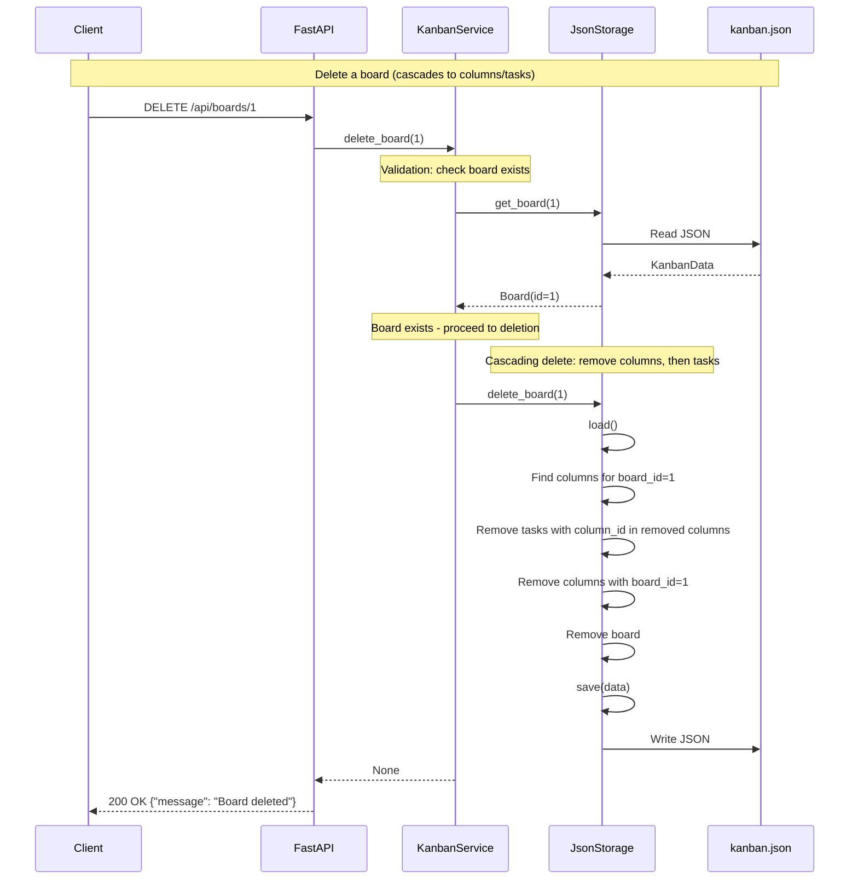

# Sequence Diagram: Delete Board

```mermaid
sequenceDiagram
    participant Client
    participant API as FastAPI
    participant Service as KanbanService
    participant Storage as JsonStorage
    participant DataFile as kanban.json

    Note over Client,DataFile: Delete a board (cascades to columns/tasks)

    Client->>API: DELETE /api/boards/1
    API->>Service: delete_board(1)
    
    Note over Service: Validation: check board exists
    Service->>Storage: get_board(1)
    Storage->>DataFile: Read JSON
    DataFile-->>Storage: KanbanData
    Storage-->>Service: Board(id=1)
    
    Note over Service: Board exists - proceed to deletion
    Note over Storage: Cascading delete: remove columns, then tasks
    Service->>Storage: delete_board(1)
    Storage->>Storage: load()
    Storage->>Storage: Find columns for board_id=1
    Storage->>Storage: Remove tasks with column_id in removed columns
    Storage->>Storage: Remove columns with board_id=1
    Storage->>Storage: Remove board
    Storage->>Storage: save(data)
    Storage->>DataFile: Write JSON
    
    Service-->>API: None
    API-->>Client: 200 OK {"message": "Board deleted"}
```