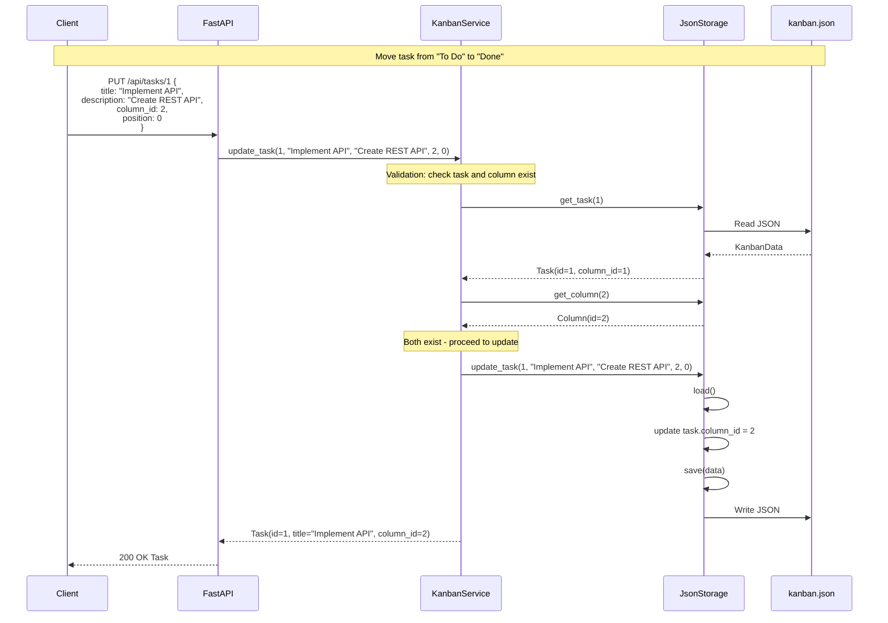

# Sequence Diagram: Move Task Between Columns

```mermaid
sequenceDiagram
    participant Client
    participant API as FastAPI
    participant Service as KanbanService
    participant Storage as JsonStorage
    participant DataFile as kanban.json

    Note over Client,DataFile: Move task from "To Do" to "Done"

    Client->>API: PUT /api/tasks/1 {<br/>title: "Implement API",<br/>description: "Create REST API",<br/>column_id: 2,<br/>position: 0<br/>}
    API->>Service: update_task(1, "Implement API", "Create REST API", 2, 0)
    
    Note over Service: Validation: check task and column exist
    Service->>Storage: get_task(1)
    Storage->>DataFile: Read JSON
    DataFile-->>Storage: KanbanData
    Storage-->>Service: Task(id=1, column_id=1)
    Service->>Storage: get_column(2)
    Storage-->>Service: Column(id=2)
    
    Note over Service: Both exist - proceed to update
    Service->>Storage: update_task(1, "Implement API", "Create REST API", 2, 0)
    Storage->>Storage: load()
    Storage->>Storage: update task.column_id = 2
    Storage->>Storage: save(data)
    Storage->>DataFile: Write JSON
    
    Service-->>API: Task(id=1, title="Implement API", column_id=2)
    API-->>Client: 200 OK Task
```