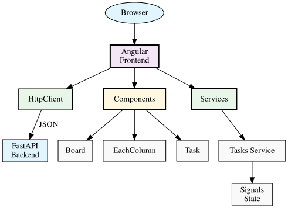

# Software Design Document - Frontend

## 1. System Overview

### 1.1 Architecture



### 1.2 Technology Stack

| Layer | Technology | Version |
|-------|-----------|--------|
| Frontend Framework | Angular | 19 |
| Language | TypeScript | - |
| Styling | Tailwind | - |

---

## 2. Architecture

### 2.1 Component Hierarchy

See [Architecture Diagram](./diagrams/architecture.svg) for visualization.

### 2.2 Frontend Services

- HTTP service for API communication
- State management for task/board data

---

## 3. Component Design

### 3.1 Frontend Directory Structure

```
frontend/src/
├── app/
│   ├── app.config.ts
│   ├── app.routes.ts
│   ├── models/
│   │   └── types.ts     # TypeScript interfaces
│   ├── services/
│   │   └── tasks.ts     # HTTP service + state
│   ├── components/
│   │   ├── board/
│   │   ├── each-column/
│   │   ├── each-row/
│   │   ├── task/
│   │   ├── task-form/
│   │   ├── add-new-task/
│   │   ├── header/
│   │   └── nav-bar/
│   └── shared/
│       └── container/
└── styles.css
```

### 3.2 Component State

- Local component state for form inputs
- Service-level state for board data

---

## 4. Data Model

### 4.1 TypeScript Interfaces

```typescript
interface Board {
  id: number;
  name: string;
  columns: Column[];
}

interface Column {
  id: number;
  name: string;
  position: number;
  board_id: number;
  tasks: Task[];
}

interface Task {
  id: number;
  title: string;
  description: string;
  column_id: number;
  position: number;
  assignee?: string;
}
```

---

## 5. Configuration

### 5.1 Development Servers

| Service | Port |
|--------|------|
| Angular Dev Server | 4200 |
| API Backend | 8000 |

### 5.2 CORS

Default CORS origins configured:
- `http://localhost:4200` (Angular dev server)
- `http://localhost:3000` (React/Vue dev server)

---

## 6. Deployment

Build for development:
```bash
ng build
```

Run development:
```bash
ng serve
```