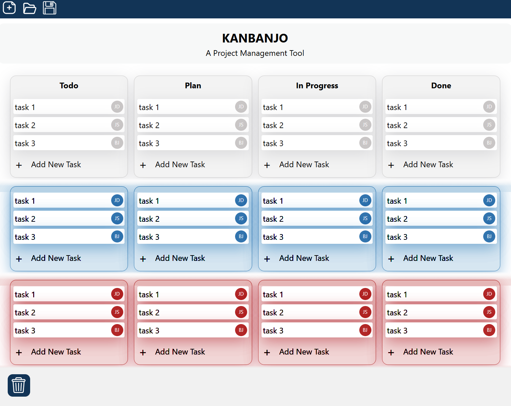

# Requirements Specification

**Project Name:** KanBan  
**Team:** Uffe, Bhuwan, Michael

## Introduction

This project aims to develop a Kanban software application, a scheduling system for managing tasks. A user interface displays cards displaying tasks that are grouped according to their progress in the development lifecycle.

This full-stack project aims to deliver a front-end and a back-end. Additionally, we aim to keep data persistent via a database, and possibly online access via cloud service providers.

## Technical Information

| Category | Details |
|----------|---------|
| **Frontend** | Angular, TypeScript, Node.js, Tailwind |
| **Backend** | Python, FastAPI, SQLAlchemy |
| **Database** | SQLite (or PostgreSQL), Alembic for migrations |
| **Cloud** | Azure / AWS |

## Functional Requirements

- Add a task
- Update a task
  - Editing the text
  - Moving the task

## Other Features

- Drag and drop on the user interface
- Remove a task
- Add name to task
- Adjustable number of columns/headers
- Databases
- Cloud (AWS/Azure)
- User accounts and roles
- User permissions

## Out of Scope

- User authentication
- Asynchronous/multi-user boards
- Adding a new board
- Swim lanes (horizontal dividers)

## Division of Roles

| Team Member | Responsibilities |
|-------------|------------------|
| **Uffe** | Project management, Backend development (Python), Unit testing |
| **Bhuwan** | Frontend development (Angular), Backend integration |
| **Michael** | Data types & databases (SQL), Cloud migration (AWS/Azure), Software architecture |

## Plan

| Day | Task |
|-----|------|
| Mandag | Planning: user stories, tech stack requirement specification |
| Tirsdag | CV and job applications |
| Onsdag | Define API endpoints, MVP development (Add task, Edit text, Moving task) |
| Torsdag | MVP estimated finished |
| Fredag | Unit testing, documentation, Main product development (drag and drop, remove task, add name to task) |
| Mandag | Unit testing, documentation, Main product development, Nice to have |
| Tirsdag | Unit testing, documentation, Main product development, Nice to have |
| Onsdag | CV and job applications |
| Torsdag | Nice to haves, project wrap up |
| Fredag | Project wrap up, Presentation |

## Mockup

In this mock-up, users can add tasks by clicking the add button within the relevant columns. We placed the "Add New Task" button in the area where users expect the new tasks to be.

In general, users should be able to modify elements by clicking on them. For example, tasks can be moved around with drag-and-drop, and can be deleted by dropping the task into the bin. Simulating a physical board like this is intended to make the interaction more intuitive, and it is an expected behaviour of kanban boards.

Text (such as columns headers or task content) can be edited by clicking on the text, and then typing in new contents. By making elements editable by clicks and drags, we can minimize clutter such as buttons and menus.

Creating and loading are handled in the top left corner. We placed these items in the top left area because users expect this as a convention.

Finally, the color coding of rows represent the swim lanes. The swim lanes can be used to define categories horizontally -- for example, the graphics team can have tasks grouped separately from the audio team.